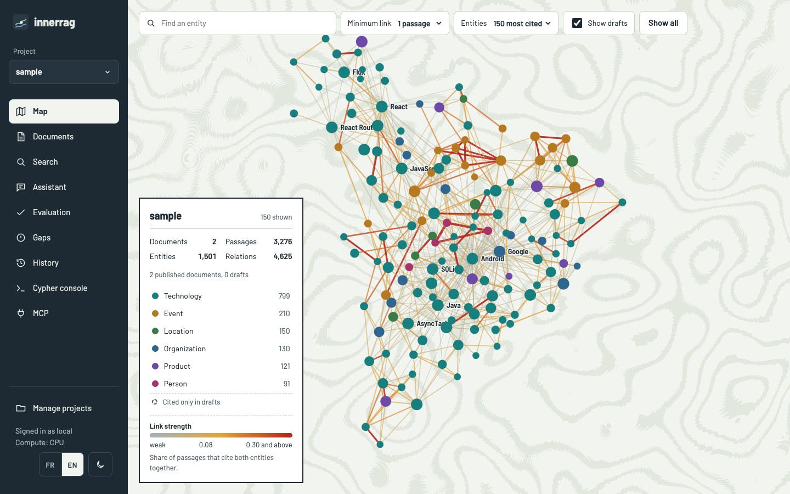
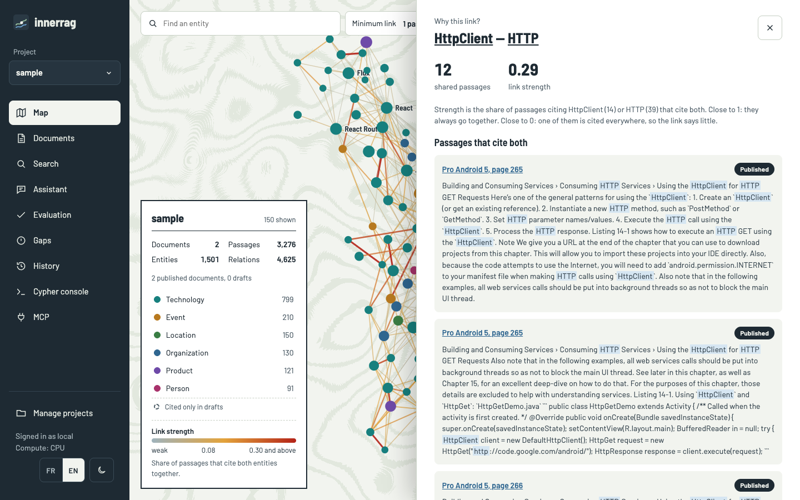
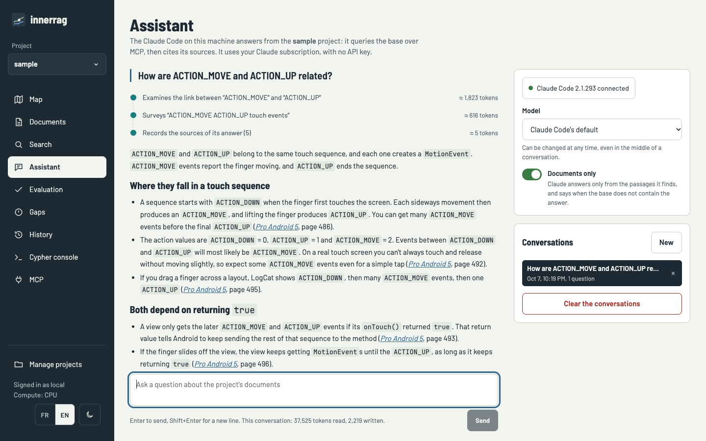
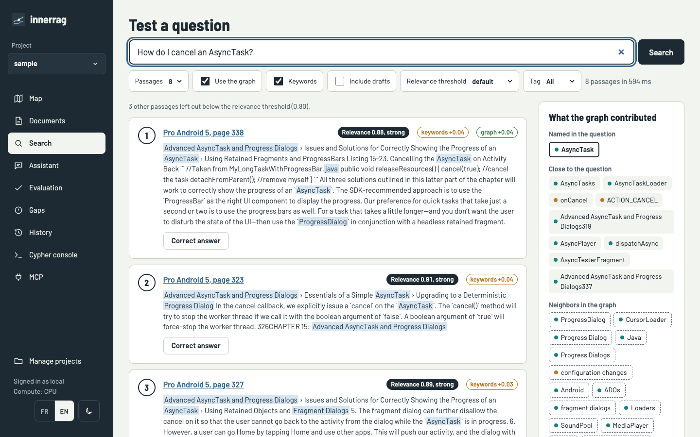
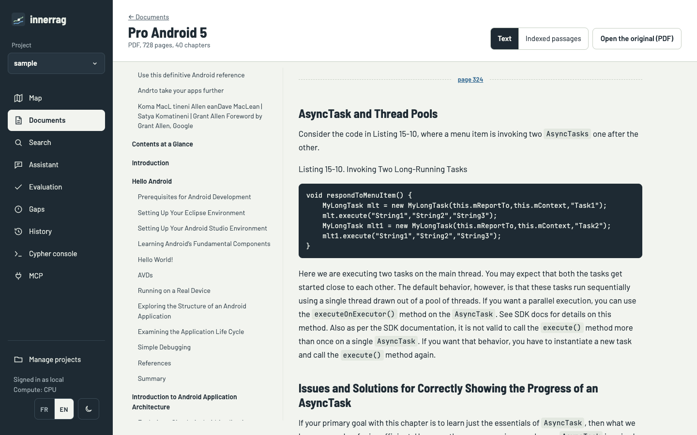
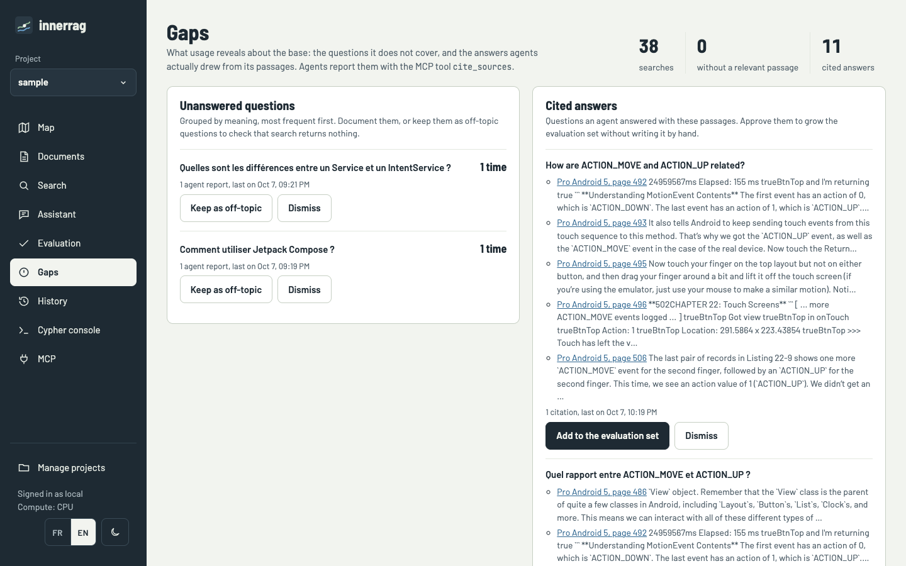
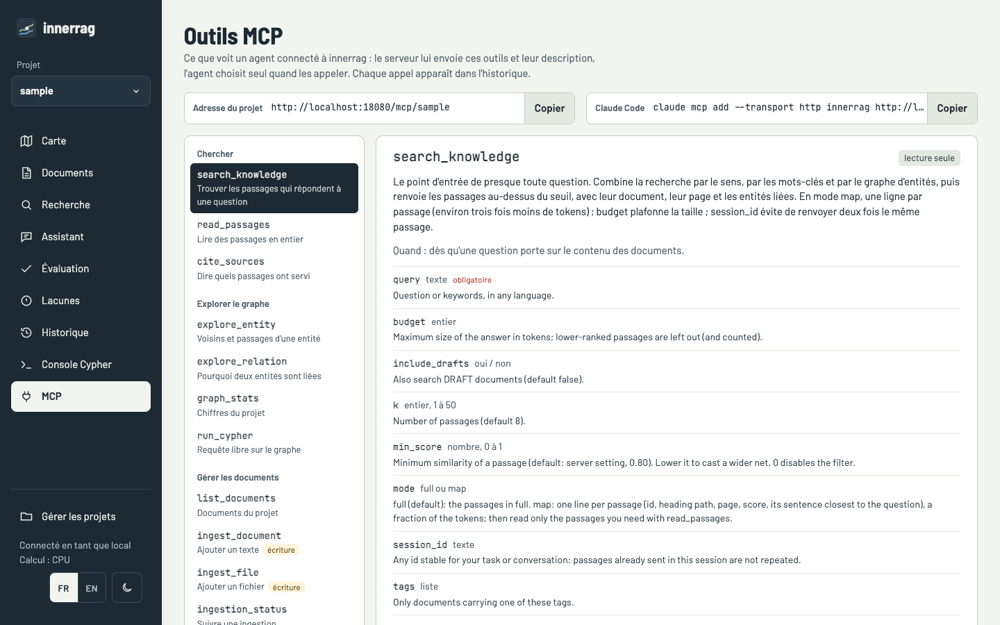
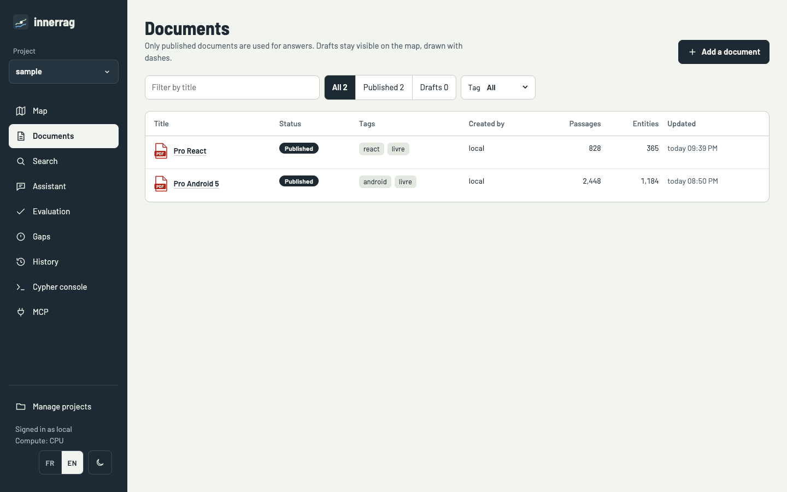
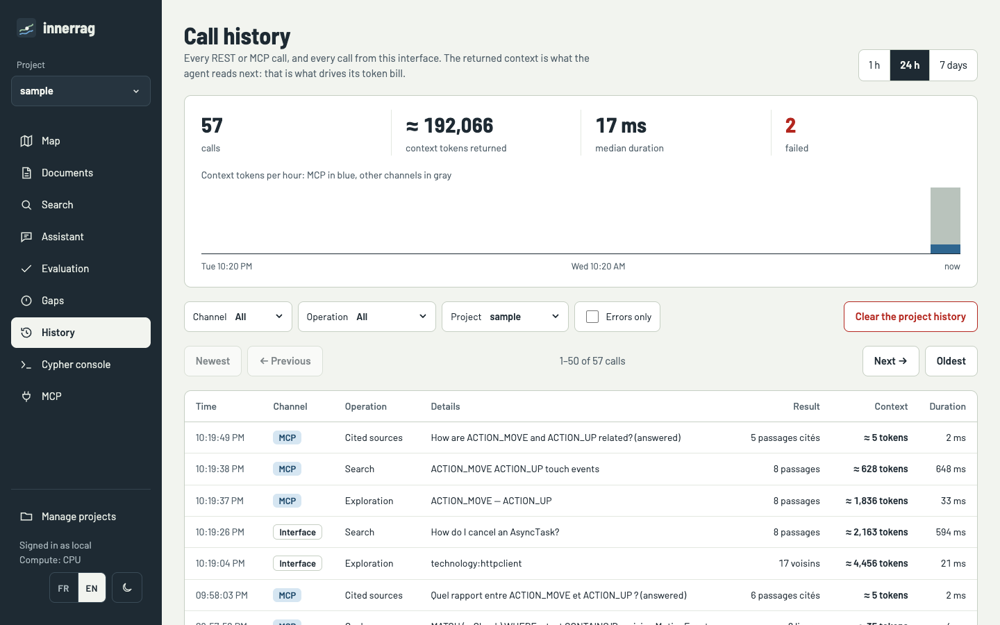

# innerrag

A **Graph RAG** server that runs entirely on your machine. It is written in Rust and built on **LadybugDB**, an embedded graph database forked from Kuzu. Everything ships in one Docker image, models included: no external API calls and no cost per query.

- **Formats**: PDF, Word (.docx, .doc), PowerPoint (.pptx, .ppt), Markdown (front matter included), HTML and plain text.
- **Asynchronous ingestion**:
  - text extraction, then chunking that follows the headings;
  - multilingual embeddings (e5-small) and zero-shot entity extraction (GLiNER);
  - entities named in the same passage are linked;
  - each ingestion is a job with visible progress, and pending jobs survive a restart.
- **Hybrid search**:
  - semantic similarity, the entity graph and keywords (BM25), with a relevance threshold, cross-encoder reranking and a cache;
  - the server returns context ready for an agent, at the size you ask for (full passages, a compact map, or a token budget);
  - it does not generate answers.
- **Isolated projects**: one database per project, in a folder you can version with git.
- **Documents**: `DRAFT` / `PUBLISHED` status, creator and tags; you can add, replace and delete them.
- **Interfaces**: REST API, an **MCP** server (HTTP), a React web interface and a Claude Code plugin (skills).
- **Call history**, with the size of the context returned (estimated tokens), the duration and the errors.
- **Assistant**: chat with the Claude Code installed on your computer, connected to the project's MCP server, with no API key.
- **Gaps**: the questions the knowledge base could not answer, and the answers agents cited, proposed as reference questions.
- **Interface** in English and French.

## Overview



| | |
|---|---|
|  |  |
| **Why this link?** The strength of a link and the passages that cite both entities. | **Assistant**: the local Claude Code queries the knowledge base over MCP and cites its sources. |
|  |  |
| **Search**: relevance, keywords, and what the graph added. | **Reader**: the PDF converted to Markdown, with a table of contents and page numbers. |
|  |  |
| **Gaps**: what the knowledge base does not cover, and the answers to validate for the evaluation set. | **MCP**: the tools as the agent sees them, explained and ready to try. |
|  |  |
| **Documents**: type, status, passages and entities. | **History**: every call, with its channel, duration and the context returned. |

To regenerate the screenshots, start the server and the chat bridge, then run `node scripts/screenshots.mjs --lang en`. The script drives a headless Chrome.

## Getting started

```bash
scripts/build.sh                    # Linux / macOS  (Windows: .\scripts\build.ps1)
docker compose up -d                # or: docker compose up -d --build
open http://localhost:8080          # web interface
```

The build scripts produce a Linux image for the machine's architecture.

- **Options**: `--platform amd64|arm64|all`, `--push`, `--tag`, and `--save file.tar` for an offline transfer. In PowerShell they are `-Platform`, `-Push`, `-Tag` and `-Save`.
- **Windows**: Docker Desktop must be in "Linux containers" mode.
- **Duration and size**: the first build takes about 10 minutes. The image is 1.6 GB (674 MB compressed).

The server has no authentication: it is single-user. `docker-compose.yml` therefore publishes the port on `127.0.0.1` only; expose it only on a network you trust.

The network is needed only at build time. The models, ONNX Runtime and LadybugDB's `vector` extension are baked into the image. On first start, a `default` project is created.

## Bundled models

| Role | Model | File |
|---|---|---|
| Embeddings (384 dimensions, English, French and 90+ languages) | `Xenova/multilingual-e5-small` | `onnx/model_quantized.onnx` (118 MB) |
| Entities (zero-shot, multilingual) | `onnx-community/gliner_multi-v2.1` | `onnx/model_fp16.onnx` (580 MB) |
| Reranking (cross-encoder, multilingual) | `cross-encoder/mmarco-mMiniLMv2-L12-H384-v1` | `onnx/model.onnx` |

You can swap them at build time with `--build-arg EMBED_REPO=… EMBED_FILE=… NER_REPO=… NER_FILE=… RERANK_REPO=… RERANK_FILE=…`; an empty `RERANK_REPO` leaves the reranker out.

- **Avoid the int8 variant of GLiNER**: its scores collapse (0.2 to 0.5, against 0.9 and above in fp16).
- **Embedding model per project**: a project remembers the model it was indexed with, and the server refuses to open it with another one.

## Configuration (environment variables)

| Variable | Default | Purpose |
|---|---|---|
| `INNERRAG_DATA` | `/data` | Data root: `projects/<id>/` and `history/` |
| `INNERRAG_BIND` | `0.0.0.0:8080` | Listen address |
| `INNERRAG_DEFAULT_PROJECT` | `default` | Project of `/mcp` and of calls without a project |
| `INNERRAG_USER` | `local` | Creator recorded on documents (single-user) |
| `INNERRAG_DEFAULT_STATUS` | `PUBLISHED` | Status of new documents (`DRAFT` to require a review) |
| `INNERRAG_NER_LABELS` | `person,organization,location,event,product,technology` | Entity types to extract |
| `INNERRAG_NER_THRESHOLD` | `0.5` | Confidence threshold of the entity extraction |
| `INNERRAG_ENTITY_STOPWORDS` | (empty) | Extra names never kept as entities, comma-separated |
| `INNERRAG_CHUNK_SIZE` / `INNERRAG_CHUNK_OVERLAP` | `1000` / `150` | Passage size and overlap, in characters |
| `INNERRAG_MIN_SCORE` | `0.80` | Minimum similarity for a passage to be returned |
| `INNERRAG_RERANK` | `true` | Reorder results with the cross-encoder |
| `INNERRAG_ENTITY_SEED_DISTANCE` | `0.18` | Maximum cosine distance for an entity close to the question to seed the graph search |
| `INNERRAG_BUFFER_POOL_MB` | `256` | Buffer pool of each open database |
| `INNERRAG_MAX_UPLOAD_MB` | `200` | Maximum request (uploaded file) size |
| `INNERRAG_KEEP_ORIGINALS` | `true` | Keep uploaded files in `<project>/files/` |
| `INNERRAG_WATCH_ROOT` / `INNERRAG_WATCH_INTERVAL` | `/watch` / `30` | Root of the watched folders, and seconds between scans |
| `INNERRAG_DEVICE` | `auto` | `auto`, `cuda` or `cpu` (see GPU) |
| `INNERRAG_THREADS` | number of CPUs | Threads for the models and the database |

## Formats and ingestion

| Format | Extraction |
|---|---|
| PDF | Converted to Markdown from the page layout (`pdftohtml -xml`) instead of raw text. See below. |
| Word `.docx` | Read directly: headings (`Heading 1`…), lists, tables and the document title |
| PowerPoint `.pptx` | One section per slide, in presentation order, with the title and the speaker notes |
| `.doc`, `.ppt` (97-2003) | `catdoc` / `catppt` (plain text) |
| Markdown | Front matter `title`, `tags`, `status`; `#` headings |
| HTML, text | HTML converted to simple Markdown; text as is |

How a PDF is converted:

- headings are inferred from font sizes, and paragraphs are joined back;
- code is spotted by its monospaced font;
- running headers, footers and page numbers are removed, and page markers are kept;
- when the layout cannot be read, extraction falls back to plain text (`pdftotext`);
- scanned PDFs (images only) are rejected: there is no OCR.

**What is kept.** The extracted text is stored in full, as Markdown, for reading. The original file is kept in the project's `files/` folder (turn this off with `INNERRAG_KEEP_ORIGINALS=false`).

**The reader.** It shows a table of contents by chapter and the formatted text. Page numbers open the original PDF at that page, and a tab lists the indexed passages.

**Chunking.** Text is split along the headings and, for a PDF, never across pages: each passage knows its page, so search results can point to "page 41". Each passage also starts with its heading path (`Chapter 3 › Installation`), which keeps its context at search time.

**Every ingestion is asynchronous.**

- The call returns `202` with a job. Jobs are queued and processed one document at a time.
- Progress (extraction, embeddings, entities, writing) is available on `GET /api/jobs/{id}`, and the interface shows it in a card at the bottom right.
- Add `?wait=true` for a synchronous call.
- Pending jobs are saved to disk and resume after a restart. A running job can be cancelled; in that case nothing is written.
- Re-importing a document only recomputes the passages that changed (13 seconds instead of 11 minutes for an unchanged book).

**Speed on CPU** (8 cores, arm64): about 0.25 s per passage, so 10 to 11 minutes for a 728-page PDF book (2,448 passages).

```bash
curl -F "file=@report.pdf" -F "tags=finance,2026" -F "status=DRAFT" \
     http://localhost:8080/api/projects/my-project/documents/upload
```

**Watched folders.** Mount a folder under `/watch` (for example a repository's `docs/`) and attach it to a project from the Projects page. Its files are imported, then kept in sync every 30 seconds; only changed passages are recomputed.

```bash
-v ./my-repo/docs:/watch/my-repo-docs:ro
```

## GPU (NVIDIA)

By default the image runs on CPU. A **CUDA** variant runs both models (embeddings and entities) on an NVIDIA card:

```bash
scripts/build.sh --gpu                 # or .\scripts\build.ps1 -Gpu  → image innerrag:cuda (linux/amd64)
docker run -d --gpus all -p 8080:8080 -v "$PWD/data:/data" innerrag:cuda
# or: docker compose --profile gpu up -d innerrag-gpu
```

- **Requirements**: a Linux host, or Windows with WSL2, an NVIDIA card, a recent driver (CUDA 12) and the NVIDIA Container Toolkit.
- **macOS**: Docker on macOS has no access to the GPU, Apple Silicon included. The CPU image is the only option on a Mac.
- **`INNERRAG_DEVICE`**:
  - `auto` (the default) uses the GPU when it is usable, otherwise the CPU, without an error;
  - `cuda` requires the GPU and fails without it;
  - `cpu` always uses the CPU.

  The device actually used is shown at startup, in `/api/config` and in the interface.
- **Image size**: the CUDA image is about 2 GB larger (ONNX Runtime GPU, cuBLAS, cuDNN).
- **Biggest gain**: entity extraction, which takes most of the ingestion time.

## Projects and sharing through git

Each project is a folder, `/data/projects/<id>/`:

```
innerrag.lbdb    the LadybugDB database (a single file)
project.json     title, description, embedding model, watched folder
eval.json        reference questions for the evaluation
feedback.jsonl   searches and citations (Gaps page)
files/           the original files (PDF, Word…)
.gitignore       temporary files
```

The server checkpoints after every write, so the `.lbdb` file is always consistent and can be committed without stopping the server. To share a project in a repository:

```bash
docker run -d -p 8080:8080 --user "$(id -u):$(id -g)" \
  -v "$PWD/.innerrag:/data/projects/my-project" innerrag
git add .innerrag && git commit -m "Knowledge base"
```

The database is a binary file, so git cannot merge two parallel changes. Agree on who ingests when.

## REST API

All project routes live under `/api/projects/{project}`.

| Method | Route | Purpose |
|---|---|---|
| GET | `/api/health`, `/api/config` | Status, models, configuration |
| GET, POST | `/api/projects` | List, create (`{"id","title","description"}`) |
| GET, PATCH, DELETE | `/api/projects/{p}` | Read, rename or set the watched folder (`watch_dir`), delete |
| POST | `…/watch/scan` | Scan the watched folder now |
| GET | `…/stats`, `…/tags` | Counts, tags |
| GET, POST | `…/documents` | List (`?status=&tag=&q=`), add JSON text (409 if the id exists) |
| POST | `…/documents/upload` | Add a file (multipart: `file`, and optionally `title`, `id`, `tags`, `status`, `source`) |
| GET, PUT, PATCH, DELETE | `…/documents/{id}` | Read, replace with text (re-indexes), edit metadata, delete |
| PUT | `…/documents/{id}/upload` | Replace with a file |
| GET | `…/documents/{id}/content` | Full text as Markdown (with `<!-- page N -->` markers for a PDF) |
| GET | `…/documents/{id}/passages?offset=&limit=` | Indexed passages, paginated, with their page |
| GET | `…/documents/{id}/file` | Original file (`#page=N` opens a PDF at that page) |
| GET | `/api/jobs?project=`, `/api/jobs/{id}` | Running and recent ingestions |
| DELETE | `/api/jobs/{id}` | Cancel a queued or running ingestion (nothing is written) |
| GET | `…/entities`, `…/entities/{id}?doc=` | Entities; an entity's neighbours, documents and passages (optionally from one document) |
| GET | `…/relation?a=&b=` | Link between two entities: shared passages, strength |
| GET | `…/graph`, `…/graph/neighbourhood/{id}` | Subgraphs for the map |
| POST | `…/search` | `{"query","k","tags","include_drafts","use_graph","use_keywords","rerank","min_score","mode","budget","session_id"}` |
| POST | `…/passages` | Full text of passages by id: `{"ids","window","session_id"}` |
| GET, PUT | `…/eval`, POST `…/eval/run` | Reference questions, and a run with metrics (`{"k","min_scores"}`) |
| GET | `…/feedback` | Gaps report: unanswered questions, cited answers |
| POST | `…/feedback/cite`, `…/feedback/dismiss`, `…/feedback/accept` | Report the passages an answer used; set a question aside; add it to `eval.json` |
| POST | `…/cypher` | Read-only Cypher |
| GET, DELETE | `/api/history` | History (`?hours=&channel=&operation=&project=&errors=&offset=&limit=`); clear it (`?project=`) |

A text document body is `{"text","title?","id?","source?","tags?":[],"status?":"DRAFT|PUBLISHED","metadata?":{}}`. Adds and replacements return `202` with the job; `?wait=true` returns the ingestion report.

## MCP

- `POST /mcp`: the default project. Every tool accepts a `project` argument, and `list_projects` lists the projects.
- `POST /mcp/{project}`: bound to one project.

**Tools**:

- search and read: `search_knowledge`, `read_passages`, `cite_sources`;
- graph: `explore_entity`, `explore_relation`, `graph_stats`, `run_cypher`;
- documents: `list_documents`, `ingest_document` (text), `ingest_file` (base64 file), `ingestion_status`.

Ingestions answer right away with a job, unless `wait: true` is passed (waits up to 2 minutes).

**Context at the size you need** (`search_knowledge`, and `POST /api/projects/{p}/search` over REST):

- `mode: "map"` returns one line per passage: id, heading path, page, score, and the sentence closest to the question. It uses about three times fewer tokens. `read_passages(ids, window)` then unfolds the useful passages, with their neighbours.
- `budget` caps the answer in tokens. Lower-ranked passages are left out, and counted.
- `session_id` keeps a passage already sent in the session from being sent again.
- Near-identical passages (cosine ≥ 0.95) are always dropped.
- **Per-project cache**:
  - a repeated search (same question and settings, unchanged data) answers in under a millisecond instead of about 450 ms;
  - cross-encoder scores are reused when only `k`, `mode` or `budget` change;
  - any write invalidates the cache;
  - a cached answer carries `cached: true`.

**Citation loop.** Once its answer is written, the agent calls `cite_sources(question, chunk_ids, outcome)`. The Gaps page then:

- groups unanswered questions by meaning, from searches with no relevant passage and from agent reports;
- proposes the cited answers as reference questions for `eval.json`.

Searches and citations are recorded in the project folder's `feedback.jsonl`.

```bash
claude mcp add --transport http innerrag http://localhost:8080/mcp/my-project
```

**GitHub Copilot CLI**: add the server to `~/.copilot/mcp-config.json` (or pass the same JSON once with `copilot --additional-mcp-config '…'`). The MCP page of the interface gives the line for the open project.

```json
{ "mcpServers": { "innerrag": { "type": "http", "url": "http://localhost:8080/mcp/my-project", "tools": ["*"] } } }
```

## Assistant (local Claude Code or GitHub Copilot CLI, no API key)

The interface's Assistant page chats with a coding agent on your computer, connected to the open project's MCP server: **Claude Code** or **GitHub Copilot CLI**, whichever you pick in the page. The server runs in Docker and cannot start those agents, so a small dependency-free bridge on the host makes the link:

```bash
python3 scripts/chat-bridge.py            # macOS, Linux
py scripts\chat-bridge.py                # Windows
```

- **What the agent can do**: each message starts the agent with the innerrag MCP server as its only tools.
  - Claude Code: `claude -p` with `--strict-mcp-config`, built-in tools (terminal, files) turned off.
  - GitHub Copilot CLI: `copilot -p` with `--available-tools` limited to innerrag's tools, and its built-in GitHub MCP server turned off.
  - The ingestion tools are left out unless you pass `--allow-writes`.
- **Accounts**:
  - Claude Code: `ANTHROPIC_API_KEY` and `ANTHROPIC_AUTH_TOKEN` are removed from the environment, so it uses the account you are signed in with, and messages count towards that subscription.
  - GitHub Copilot CLI: it uses your Copilot login (`copilot`, then `/login`), and messages count towards your Copilot plan (premium requests are shown under each answer). The models offered depend on that plan; one it lacks is refused with a clear error.
- **Security**: the bridge listens on `127.0.0.1:18765` and only answers pages of the interface (it checks the `Origin` header).
- **Conversations**: they resume the Claude Code session (`--resume`) and are kept in the browser, per project. Their MCP calls appear in the history.
- **Settings in the page**:
  - the agent: Claude Code or GitHub Copilot (an agent that is not installed is greyed out); switching agents starts a new conversation, since a session belongs to one agent;
  - the model: for Claude Code, Opus, Sonnet, Haiku or its default; for Copilot, GPT-4.1, GPT-5, Claude Sonnet 4.5… or its default;
  - a "Documents only" switch, on by default. Claude then answers only from the passages it found, and says when the knowledge base does not cover the question. When it is off, Claude may add general knowledge in a separate "outside the documents" part.
- **Bridge options**: `--innerrag http://localhost:18080`, `--port`, `--model sonnet` (default Claude model), `--copilot-model gpt-4.1` (default Copilot model), `--claude` / `--copilot` (executables), `--allow-writes`. The bridge skips the shim VS Code puts in the PATH and runs the Copilot CLI itself; its JSON output needs `--experimental`, which the bridge passes.

## Claude Code plugin (skills)

The repository is also a Claude Code marketplace. The `innerrag` plugin brings the MCP server and seven skills: search, ingestion, documents, projects, graph exploration, usage, and spec compliance. They rely on a small dependency-free Python CLI (`plugins/innerrag/scripts/innerrag.py`).

```
/plugin marketplace add /path/to/innerrag
/plugin install innerrag@innerrag
```

The plugin reads `INNERRAG_URL` (default `http://localhost:8080`) and `INNERRAG_PROJECT`.

**Spec compliance report** (`innerrag-spec-check`). Ask Claude Code, in the repository to check, something like "compare this code with the specs in innerrag and give me the PDF report":

1. it reads the specifications stored in innerrag (by default the documents tagged `spec`);
2. it breaks them down into numbered requirements, each with its source (document, section, page);
3. it looks for evidence of each one in the code and gives it a status: compliant, partial, non-compliant or not verifiable, with a severity for the gaps;
4. it writes the analysis as JSON, and `scripts/spec_report.py` renders it into a PDF.

The PDF always has the same layout: header (project, repository, commit, specifications), summary with the compliance rate, requirements table, gaps in detail, code missing from the specifications, method and limits. It is in English or French, as asked; the JSON kept next to it re-renders the report in the other language (`spec_report.py analysis.json --lang en`). The PDF is printed by a local Chrome, Chromium or Edge; `spec_report.py --example` shows the expected JSON.

## Development

Rust is not required on the machine: everything compiles in a container. The container uses Debian trixie with GCC 14, which LadybugDB's C++20 headers need.

```bash
docker build --target models -t innerrag-models .           # models, once
cd ui && npm install && npm run dev                          # UI on :5173, proxied to :18080
```

Code layout:

- `src/`: the server;
- `ui/`: the web interface (React + Vite);
- `plugins/innerrag/`: the Claude Code plugin;
- `docs/PLAN.md`: the initial plan;
- `docs/IDEES.md`: ideas for what comes next.

The interface mock-up was designed in Claude Design.
